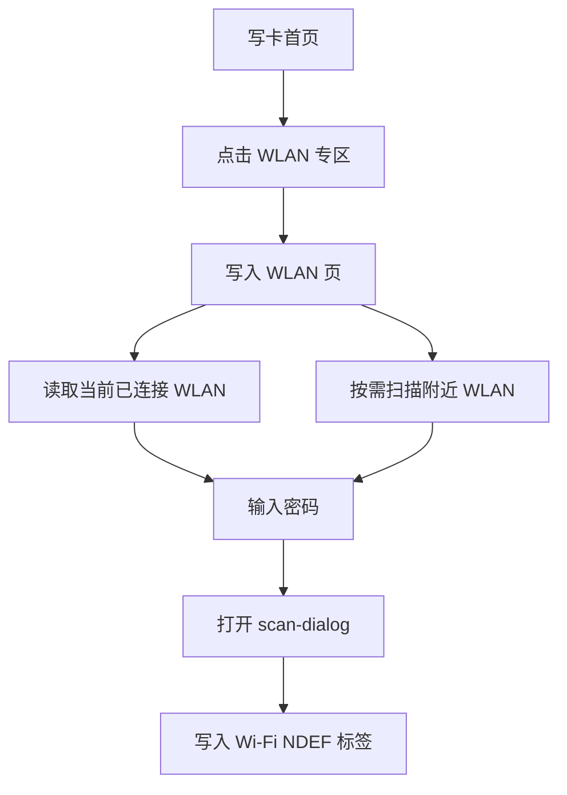

# WLAN NFC Prototype Sync

**Date:** 2026-05-15

**Purpose:** Sync the write-menu entry, WLAN write page layout, and user flow with the implemented branch.

## Home Menu Prototype

The write menu now has five entry cards. The `WLAN` card sits between the `网页专区` and `本地音视频` cards so the new flow is visible from the first screen.

```text
┌──────────────────────────────┐
│ 应用专区                      │
└──────────────────────────────┘

┌──────────────┐ ┌──────────────┐
│ 音乐专区      │ │ 网页专区      │
└──────────────┘ └──────────────┘

┌──────────────────────────────┐
│ WLAN 专区                    │
│ 自动带出当前网络，或扫描附近  │
│ WLAN，再把配网信息写入 NFC。  │
└──────────────────────────────┘

┌──────────────────────────────┐
│ 本地音视频                    │
└──────────────────────────────┘
```

## WLAN Write Page Prototype

```text
┌──────────────────────────────┐
│ 顶部导航：写入 WLAN           │
├──────────────────────────────┤
│ 提示：仅支持 WPA2-Personal    │
├──────────────────────────────┤
│ 当前 WLAN 卡片               │
│ 已连接网络，点按可直接使用    │
├──────────────────────────────┤
│ [扫描附近 WLAN] 按钮         │
│ 附近 WLAN 列表（按需展开）    │
├──────────────────────────────┤
│ Wi-Fi 密码输入框             │
├──────────────────────────────┤
│ [写入 NFC 标签]              │
└──────────────────────────────┘
```

## Interaction Notes

- The page should try `wx.getConnectedWifi()` on load and preselect the current SSID when available.
- Nearby scan stays opt-in so the app does not ask for location permission on first paint.
- The primary write button remains disabled until both `SSID` and `password` are present.
- Writing uses the existing `scan-dialog` and hands it one MIME NDEF record with type `application/vnd.wfa.wsc`.

## Copy Sync

- Home card title: `WLAN 专区`
- Home card body: `自动带出当前网络，或扫描附近 WLAN，再把配网信息写入 NFC。`
- Page title: `写入 WLAN`
- Page note: `仅支持 WPA2-Personal 网络，请勿用于开放 / WEP / 企业网络。`

## Flow Diagram


